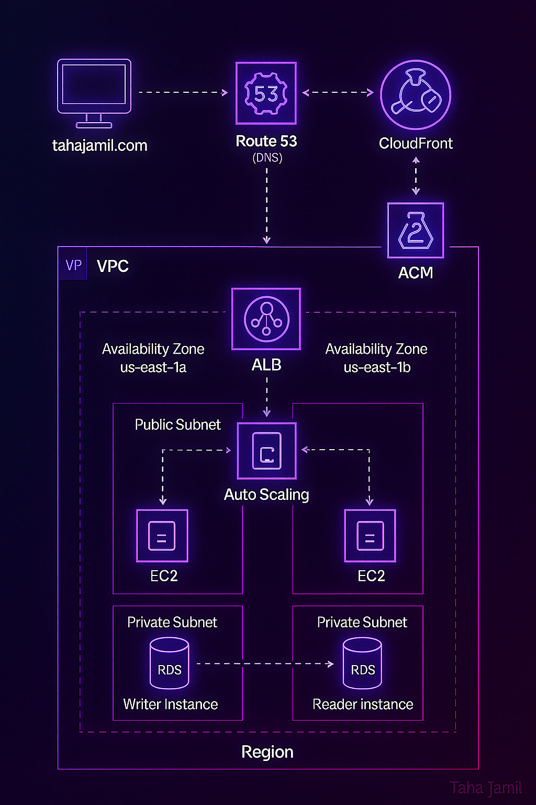

# AWS 2-Tier Architecture with Terraform

This project provisions a **highly available, secure, and scalable AWS infrastructure** using **modular Terraform**.  
It includes a **custom VPC**, **Public & Private Subnets**, **ALB**, **Auto Scaling**, **EC2 Instances**, **RDS**, **IAM Roles**, **Route 53**, and **CloudFront** with **ACM**.

---

## 📖 Overview

**Main features:**
- Modularized Terraform design for reusability.
- Fully automated VPC setup with Public & Private subnets across **2 AZs**.
- Internet Gateway, NAT Gateways, EIPs, Route Tables.
- ALB with Target Groups.
- Auto Scaling Group with Launch Templates.
- Secure RDS setup with Writer & Reader.
- Route 53 domain, CloudFront CDN, ACM SSL.
- IAM Roles and Instance Profiles.
- Clear **dependencies** to ensure correct creation order.

---

## ⚙️ Prerequisites

- [Terraform](https://www.terraform.io/) installed.
- AWS CLI configured with `aws configure`.
- A registered domain in **Route 53**.
- Valid AWS IAM user with sufficient permissions.

---

## 🗺️ Architecture Diagram

_Optional: Add a diagram here._



---

## 📂 Project Structure

```plaintext
.
├── modules/
│   ├── aws-vpc/
│   ├── aws-alb/
│   ├── aws-autoscaling/
│   ├── aws-rds/
│   ├── aws-iam/
│   ├── aws-cloudfront-acm-route53/
│   ├── security-group/
├── main.tf
├── variables.tf
├── backend.tf
├── terraform.tfvars
├── README.md


---

## 🏗️ Key Components

- **🔹 VPC (Virtual Private Cloud)**  
  A logically isolated section of the AWS Cloud where you launch your resources.  
  Includes public and private subnets across multiple Availability Zones (AZs) for fault tolerance.

- **🔹 Internet Gateway (IGW)**  
  Enables communication between your VPC and the internet.

- **🔹 NAT Gateways (NGW)**  
  Allow instances in private subnets to connect out to the internet or AWS services without exposing them to inbound internet traffic.

- **🔹 Application Load Balancer (ALB)**  
  Distributes incoming application traffic across multiple EC2 instances in multiple AZs for better availability and performance.

- **🔹 Auto Scaling Group (ASG)**  
  Automatically adjusts the number of EC2 instances according to defined scaling policies, maintaining performance and optimizing cost.

- **🔹 EC2 Instances**  
  Virtual servers running your web application inside public subnets.

- **🔹 Amazon RDS (Relational Database Service)**  
  Provides managed relational databases with a primary Writer and replica Reader instance for high availability and read scalability.

- **🔹 Security Groups**  
  Act as virtual firewalls, controlling inbound and outbound traffic for instances and other resources.

- **🔹 IAM Role & Instance Profile**  
  Provides secure permissions for EC2 instances to interact with other AWS services (for example, using SSM).

- **🔹 Route 53**  
  AWS’s highly available and scalable Domain Name System (DNS) web service. Routes internet traffic to your ALB.

- **🔹 CloudFront**  
  A global Content Delivery Network (CDN) that securely delivers your app’s content worldwide with low latency.

- **🔹 AWS Certificate Manager (ACM)**  
  Handles SSL/TLS certificates for your CloudFront distribution to ensure secure HTTPS communication.


### 1. Configure AWS CLI
First, configure your AWS credentials:

```bash
aws configure
```

### 2. Initialize Terraform
Navigate to the root of your project where your main Terraform configuration (`main.tf`, `variables.tf`, etc.) resides and initialize the Terraform working directory. This downloads the necessary providers and modules.

```bash
terraform init
```

### 3. Review the Plan
Before applying any changes, we highly recommend reviewing the execution plan. This command shows you what Terraform will do without actually making any changes.

```bash
terraform plan -var-file="terraform.tfvars"
```

**Note:** You'll need to create a `terraform.tfvars` file to provide values for the input variables defined in `variables.tf`. An example `terraform.tfvars` structure is provided in the Configuration section.

### 4. Apply the Configuration
If the plan looks good, apply the configuration. Terraform will provision the AWS resources as defined.

```bash
terraform apply -var-file="terraform.tfvars"
```

Type `yes` when prompted to confirm the apply operation.

## Terraform Modules

This project is structured with the following custom Terraform modules:

- **`./modules/aws-vpc`**: Manages the creation of the VPC, subnets (public and private), Internet Gateway, NAT Gateways, and route tables.

- **`./modules/aws-alb`**: Configures the Application Load Balancer and its target group.

- **`./modules/security-group`**: Defines security groups for the ALB, web instances, and the database.

- **`./modules/aws-rds`**: Deploys the Amazon RDS database instance(s) (writer and reader).

- **`./modules/aws-iam`**: Manages IAM roles and instance profiles for EC2 instances.

- **`./modules/aws-autoscaling`**: Sets up the Auto Scaling Group and Launch Template for your EC2 instances.

- **`./modules/aws-cloudfront-acm-route53`**: Configures Route 53 DNS records, CloudFront distribution, and ACM certificates for domain management and content delivery.

## Configuration

All configurable parameters are defined in `variables.tf`. You should provide values for these variables in a `terraform.tfvars` file at the root of your project.

### Variables (variables.tf)

Here's an example of what your `terraform.tfvars` file might look like. Remember to replace placeholder values with your actual desired configurations.

```hcl
# VPC Module Variables
VPC-NAME         = "my-app-vpc"
VPC-CIDR         = "10.0.0.0/16"
IGW-NAME         = "my-app-igw"
PUBLIC-CIDR1     = "10.0.1.0/24"
PUBLIC-SUBNET1   = "my-app-public-subnet-1a"
PUBLIC-CIDR2     = "10.0.2.0/24"
PUBLIC-SUBNET2   = "my-app-public-subnet-1b"
PRIVATE-CIDR1    = "10.0.11.0/24"
PRIVATE-SUBNET1  = "my-app-private-subnet-1a"
PRIVATE-CIDR2    = "10.0.12.0/24"
PRIVATE-SUBNET2  = "my-app-private-subnet-1b"
EIP-NAME1        = "my-app-eip-1"
EIP-NAME2        = "my-app-eip-2"
NGW-NAME1        = "my-app-ngw-1"
NGW-NAME2        = "my-app-ngw-2"
PUBLIC-RT-NAME1  = "my-app-public-rt-1"
PUBLIC-RT-NAME2  = "my-app-public-rt-2"
PRIVATE-RT-NAME1 = "my-app-private-rt-1"
PRIVATE-RT-NAME2 = "my-app-private-rt-2"

# ALB Module Variables
ALB-NAME          = "my-app-alb"
TG-NAME           = "my-app-tg"

# Security Group Module Variables
WEB-SG-NAME       = "my-app-web-sg"
DB-SG-NAME        = "my-app-db-sg"

# RDS Module Variables
SG-NAME            = "my-app-rds-sg" # This variable seems redundant with DB-SG-NAME; consider consolidating in your module
RDS-USERNAME       = "admin"
RDS-PWD            = "YourStrongPasswordHere" # CHANGE THIS!
DB-NAME            = "myappdb"
RDS-NAME           = "my-app-rds-instance"

# IAM Module Variables
IAM-ROLE              = "my-app-ec2-role"
IAM-POLICY            = "my-app-ec2-policy"
INSTANCE-PROFILE-NAME = "my-app-instance-profile"

# Autoscaling Module Variables
AMI-NAME              = "ami-0abcdef1234567890" # Replace with a valid AMI ID for your region (e.g., Amazon Linux 2 HVM)
LAUNCH-TEMPLATE-NAME  = "my-app-launch-template"
ASG-NAME              = "my-app-asg"

# Route53, CloudFront, ACM Module Variables
DOMAIN-NAME           = "example.com" # Replace with your registered domain name
CDN-NAME              = "my-app-cdn"
```